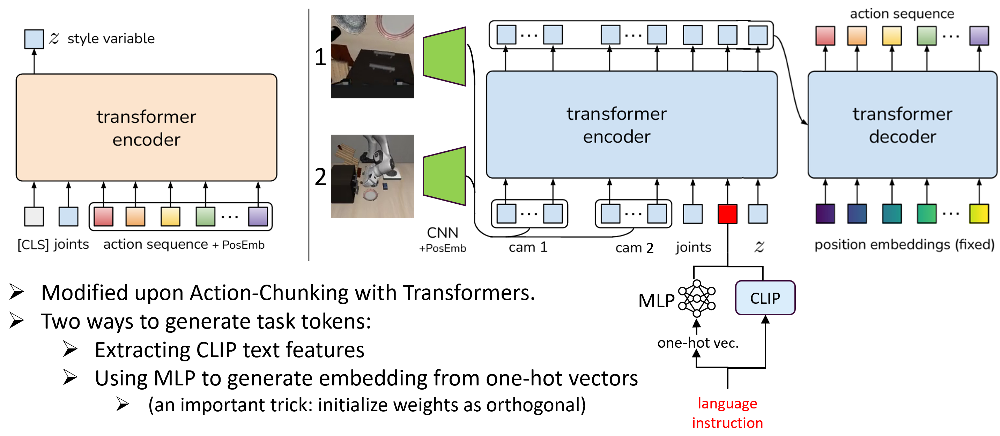

# Language-Conditioned Multi-Task Policy

This repository contains the code for the final project "Investigating the Role of Language in Language-Conditioned Multi-Task Policies" of the undergraduate course "Intelligent Robot and Systems" at Tsinghua University. 

This codebase is based on the [ACT](https://github.com/tonyzhaozh/act) framework and the [LIBERO](https://github.com/Lifelong-Robot-Learning/LIBERO) benchmark. We implemented language-conditioned policies on ACT by generating language tokens and embedding them into the input state for transformers. The language tokens are generated by either extracting text features using CLIP or using one-hot vectors.



## Installation

```
conda create -n aloha python=3.8.10
conda activate aloha
pip install torchvision
pip install torch
pip install pyquaternion
pip install pyyaml
pip install rospkg
pip install pexpect
pip install dm_control==1.0.14
pip install opencv-python
pip install matplotlib
pip install einops
pip install packaging
pip install h5py
pip install ipython
pip install wandb
pip install imageio
pip install transformers
cd detr && pip install -e .
```

For training and evaluation, you also need to download LIBERO datasets and codebase. Please follow the instructions in [here](https://lifelong-robot-learning.github.io/LIBERO/html/getting_started/installation.html):
```
pip install robosuite
git clone git@github.com:Lifelong-Robot-Learning/LIBERO.git
cd LIBERO
pip install -e .

# download datasets
python benchmark_scripts/download_libero_datasets.py --datasets libero_goal
```


## Usage:

### Training Scripts

```
[T459: finished] CUDA_VISIBLE_DEVICES=0 python act/imitate_episodes.py --policy_class ACT --kl_weight 10 --chunk_size 60 --hidden_dim 512 --batch_size 45 --dim_feedforward 3200 --num_epochs 80000 --lr 5e-5 --seed 0 --task-name libero3 --exptid T459 --config-path config/data_libero_3_T459.yml 

[T459_onehot: finished] CUDA_VISIBLE_DEVICES=0 python act/imitate_episodes.py --policy_class ACT --kl_weight 10 --chunk_size 60 --hidden_dim 512 --batch_size 45 --dim_feedforward 3200 --num_epochs 80000 --lr 5e-5 --seed 0 --task-name libero3 --exptid onehot-T459 --config-path config/data_libero_3_T459.yml --lang-backbone OneHot

[9tasks_CLIP: finished] CUDA_VISIBLE_DEVICES=1 python act/imitate_episodes.py --policy_class ACT --kl_weight 10 --chunk_size 60 --hidden_dim 512 --batch_size 45 --dim_feedforward 3200 --num_epochs 250005 --lr 5e-5 --seed 0 --task-name libero3 --exptid 9tasks-CLIP --config-path config/data_libero_9.yml 

[9tasks_onehot: finished] CUDA_VISIBLE_DEVICES=0 python act/imitate_episodes.py --policy_class ACT --kl_weight 10 --chunk_size 60 --hidden_dim 512 --batch_size 45 --dim_feedforward 3200 --num_epochs 250005 --lr 5e-5 --seed 0 --task-name libero3 --exptid 9tasks-onehot --config-path config/data_libero_9.yml --lang-backbone OneHot
```

### Evaluation Scripts

```
[T459 one-hot] CUDA_VISIBLE_DEVICES=0 python evaluation/sim_evaluation.py --policy_class ACT --kl_weight 10 --chunk_size 60 --hidden_dim 512 --batch_size 45 --dim_feedforward 3200 --num_epochs 80000 --lr 5e-5 --seed 0 --task-name libero3 --exptid onehot-T459 --config-path config/data_libero_3_T459.yml --lang-backbone OneHot --resume_ckpt 70000

[T459 CLIP] CUDA_VISIBLE_DEVICES=1 python evaluation/sim_evaluation.py --policy_class ACT --kl_weight 10 --chunk_size 60 --hidden_dim 512 --batch_size 45 --dim_feedforward 3200 --num_epochs 80000 --lr 5e-5 --seed 0 --task-name libero3 --exptid T459 --config-path config/data_libero_3_T459.yml --resume_ckpt 70000

[9tasks_CLIP] CUDA_VISIBLE_DEVICES=1 python evaluation/sim_evaluation.py --policy_class ACT --kl_weight 10 --chunk_size 60 --hidden_dim 512 --batch_size 45 --dim_feedforward 3200 --num_epochs 250005 --lr 5e-5 --seed 0 --task-name libero3 --exptid 9tasks-CLIP --config-path config/data_libero_9.yml --resume_ckpt 250000

[9tasks_onehot] CUDA_VISIBLE_DEVICES=1 python evaluation/sim_evaluation.py --policy_class ACT --kl_weight 10 --chunk_size 60 --hidden_dim 512 --batch_size 45 --dim_feedforward 3200 --num_epochs 250005 --lr 5e-5 --seed 0 --task-name libero3 --exptid 9tasks-onehot --config-path config/data_libero_9.yml --lang-backbone OneHot --resume_ckpt 250000
```

To draw the embedding similarity graph, see `scripts/emb_similarity.ipynb`.

## Experiment Results

### Comparison between CLIP embedding and one-hot vectors on seen tasks

**3 tasks (data_libero_3.yml)**

Evaluated over 20 trials. Trained 70000 epochs.

|  | T1 | T2 | T3 |
| ----- | ----- | ----- | ----- |
| CLIP | 95% | 60% | 80% |
| OneHot(MLP) | 40% | 45% | 0% |
| OneHot(MLP+initialization) | 80% | 80% | 55% |

**[NEW] 3 tasks (data_libero_3_T459.yml)**

This is for testing generalization to new task.  
Evaluated over 20 trials. Trained 70000 epochs.

> Training tasks:  
> T4 : put the bowl on the plate  
> T9 : put the wine bottle on top of the cabinet  
> T5 : put the bowl on the stove  
> 
> Testing task:  
> T6 : put the bowl on top of the cabinet  

|  | T4 | T5 | T9 |
| ----- | ----- | ----- | ----- |
| CLIP-3 | 80% | 80% | 100% |
| OneHot-3 | 80% | 95% | 90% |

**9 tasks (data_libero_9.yml)**

Evaluated over 20 trials. 

| | T1 | T2 | T3 | T4 | T5 | T7 | T8 | T9 | T10 |
| ----- | ----- | ----- | ----- | ----- | ----- | ----- | ----- | ----- | ----- |
| CLIP-9 (25000) | 75% | 60% | 70% | 55% | 80% | 75% | 65% | 75% | 100% |
| CLIP-9 (24000) | 95% | 70% | 55% | 50% | 90% | 70% | 75% | 75% | 100% |
| OneHot-9 (25000) | 95% | 60% | 55% | 70% | 75% | 60% | 75% | 50% | 100% |
| OneHot-9 (24000) | 100% | 75% | 55% | 70% | 80% | 60% | 80% | 65% | 90% |


**10 tasks (data_libero_10.yml):**

Evaluated over 20 trials. Trained 240000 epochs.

> Task order:  
> T1: open the middle drawer of the cabinet  
> T2: open the top drawer and put the bowl inside  
> T3: push the plate to the front of the stove  
> T4: put the bowl on the plate  
> T5: put the bowl on the stove  
> T6: put the bowl on top of the cabinet  
> T7: put the cream cheese in the bowl  
> T8: put the wine bottle on the rack  
> T9: put the wine bottle on top of the cabinet  
> T10: turn on the stove  

| | T1 | T2 | T3 | T4 | T5 | T6 | T7 | T8 | T9 | T10 |
| ----- | ----- | ----- | ----- | ----- | ----- | ----- | ----- | ----- | ----- | ----- |
| CLIP-10 | 85% | 75% | 65% | 60% | 75% | 95% | 60% | 70% | 70% | 95% |

### Test CLIP and one-hot on unseen task

Evaluated over 20 trials.

| Task | CLIP-3 | CLIP-9  | OneHot-3 | OneHot-9 |
| ----- | ----- | ----- | ----- | ----- |
|T6| 0% | 5% | 0% | 0% |

### Visualization of embedding similarity

The embedding similarity graph for CLIP-3, CLIP-9, OneHot-3, OneHot-9 are drawn by `scripts/emb_similarity.ipynb` and saved in `scripts/emb_similarity_res`.

## Conclusions

- Can we successfully train an end-to-end language-conditioned multi-task policy?
    - <font color=purple>Yes!</font>

- How does performance change if we replace language instructions with one-hot vectors? 
    - <font color=purple>One-hot embeddings can reflect motion similarity, while language embedding can capture both semantics and motions.</font>
    - <font color=purple>No significant difference in success rates on trained tasks.</font>

    - Does the use of language help generalization? 
        - <font color=purple>Not yet. </font>
    - How do the number of tasks and the scale of data influence the results?
        - <font color=purple>A slightly lower success rate on individual tasks when trained with more tasks.</font>
        - <font color=purple>Learned (slightly) better task representations with more trained tasks.</font>


---

This codebase is modified from OpenTelevision.
```
@article{cheng2024tv,
title={Open-TeleVision: Teleoperation with Immersive Active Visual Feedback},
author={Cheng, Xuxin and Li, Jialong and Yang, Shiqi and Yang, Ge and Wang, Xiaolong},
journal={arXiv preprint arXiv:2407.01512},
year={2024}
}
```